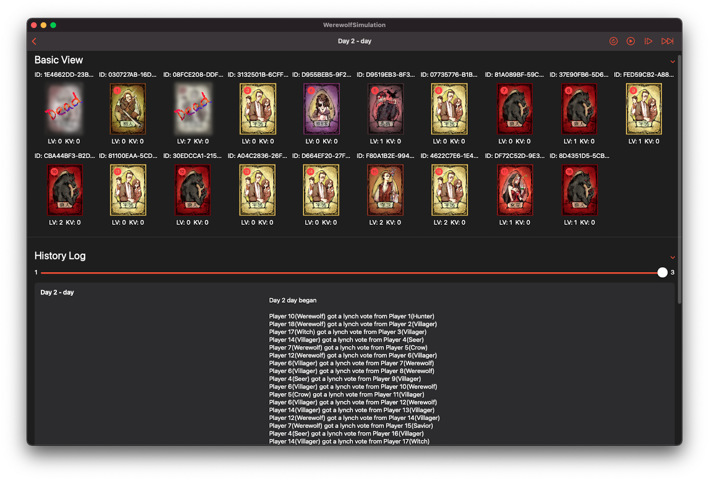

# CoreMafia

An abstraction of a mafia game

## API

```swift
let game = WerewolfGame(werewolf: 6, villager: 5)
game.autoplay()
print(game.resultString)
```

## Demo

[WerewolfSimulation](https://github.com/Kyle-Ye/WerewolfSimulation)



